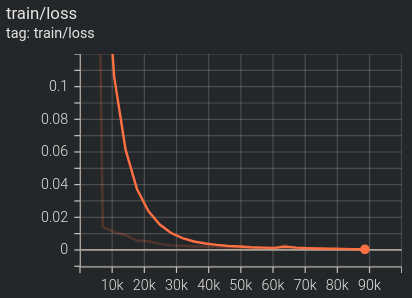
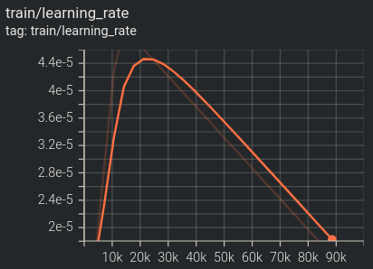
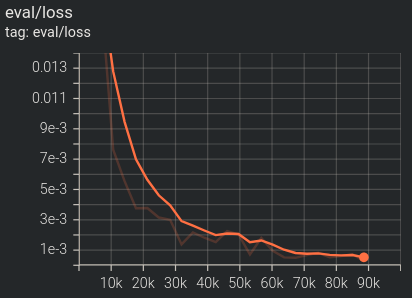
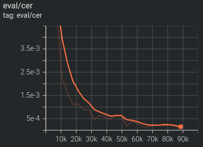
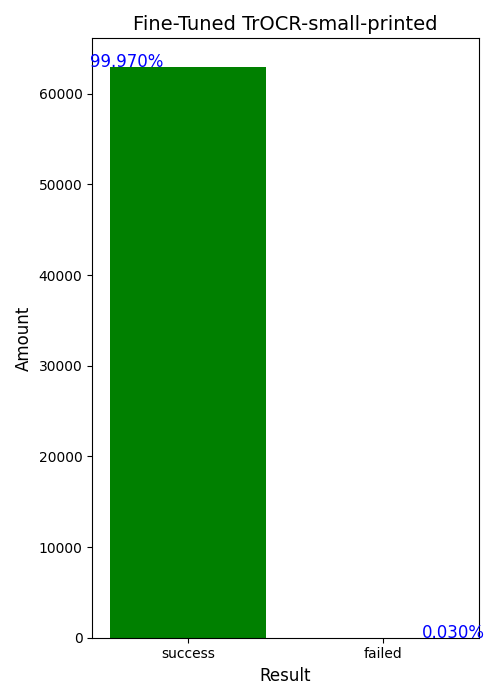

# YZU CAPTCHA TrOCR

## Introduction

This project is part of the [YZU Course Bot](https://github.com/sunsun8170/YZU-Course-Bot) initiative. It fine-tunes a TrOCR-small-printed model on 419,880 captchas collected from the [YZU Course Selection System](https://isdna1.yzu.edu.tw/Cnstdsel/Index.aspx) and is trained on a desktop with an NVIDIA GeForce RTX 4090 GPU featuring 24 GB of VRAM. The top-performing model was preserved for future use in the YZU Course Bot, facilitating automatic captcha recognition during system login.

## Environment

Below are the steps to set up the environment.

```bash!
conda create -n env_name python=3.12
conda activate env_name
cd path/to/YZU-CAPTCHA-TrOCR-main
pip install -r requirements.txt
```

Below is the platform used in this study.

|          | **Desktop**                                           |
|:-------: |------------------------------------------------------ |
| **GPU**  | NVIDIA GeForce RTX 4090                               |
| **CPU**  | 12th Gen Intel(R) Core(TM) i9-12900K (24) @ 5.20 GHz  |
| **RAM**  | 64 GB                                                 |
|  **OS**  | Ubuntu noble 24.04 x86_64                             |

## Usage

This project contains all the code for data collection, preprocessing, training, and testing. To run each process sequentially or individually, follow the instructions below.

```python!
python main.py [-h] [-d] [-p] [-t] [-s] [-i]
```

* `no parameters`
Runs preprocessing, training, and testing sequentially.
* `-h, --help`
Displays this help message and exits.
* `-d, --dataset`
Collects CAPTCHA images from the YZU Course Selection System.
* `-p, --preprocess`
Executes the preprocessing step.
* `-t, --train`
Executes the training step.
* `-s, --testing`
Executes the testing step.
* `-i, --info`
Displays the model architecture, total parameters and trainable parameters information.

## Results of Each Process

### Dataset

We collected a total of 419,880 CAPTCHA images from the [YZU Course Selection System](https://isdna1.yzu.edu.tw/Cnstdsel/Index.aspx) to be used as the dataset for later processing.

To obtain the dataset, download the `captcha_imgs.zip` file from the [Releases]() page and place it in the same directory as `main.py`.

### Preprocess

The dataset was splitted into train, evaluation, and test sets using a 7:1.5:1.5 ratio.

|   **Dataset**   | **ratio**  |  **imgs**  |
|:--------------: |:---------: |:---------: |
|    **train**    |    0.7     |  293,916   |
| **evaluation**  |    0.15    |   62,982   |
|    **test**     |    0.15    |   62,982   |
|   **_TOTAL_**   |    _1_     | _419,880_  |

### Train & Evaluation

The TrOCR-small-printed model was fine-tuned on a training set of 293,916 CAPTCHA images and evaluated on an evaluation set of 62,982 CAPTCHA images.

The Character Error Rate (CER) metric is used to determine the model's best performance, after which the model was saved. A lower CER indicates better model performance.

|   |   |
|------------------------------------------------ |------------------------------------------------------------------ |
|     |                         |

To access the full training results, download the `results.zip` file from the [Releases]() page and place it in the same directory as `main.py`. Then you may start a TensorBoard session by running the following command in your terminal.

```bash!
tensorboard --logdir=./results/train
```

### Test

The top-performing model was saved and tested on the test set containing 62,982 CAPTCHA images.

<p align="center">
  
</p>

## Conclusion

The final results demonstrated that **this fine-tuned TrOCR-small-printed model for recognizing CAPTCHA images on the YZU Course Selection System achieved an accuracy of _99.97%_**.

## References

1. [TrOCR: Transformer-based Optical Character Recognition with Pre-trained Models](https://arxiv.org/pdf/2109.10282)
2. [TrOCR - Hugging Face](https://huggingface.co/docs/transformers/model_doc/trocr)
3. TrOCR – Getting Started with Transformer Based OCR
   * [Website](https://learnopencv.com/trocr-getting-started-with-transformer-based-ocr/)
   * [Source Code](https://github.com/spmallick/learnopencv/tree/master/TrOCR-Getting-Started-with-Transformer-Based-OCR)
   * [YouTube](https://www.youtube.com/watch?v=2k7aOpiCU-I)
4. Fine Tuning TrOCR – Training TrOCR to Recognize Curved Text
   * [Website](https://learnopencv.com/fine-tuning-trocr-training-trocr-to-recognize-curved-text/)
   * [Source Code](https://github.com/spmallick/learnopencv/tree/master/Fine-Tuning-TrOCR)
   * [YouTube](https://www.youtube.com/watch?v=-8a7j6EVjs0)
5. [Google Python Style Guide](https://google.github.io/styleguide/pyguide.html)

## Contact me

Feel free to reach out to me at <s1101613@mail.yzu.edu.tw>
